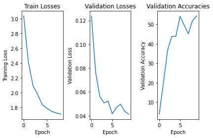
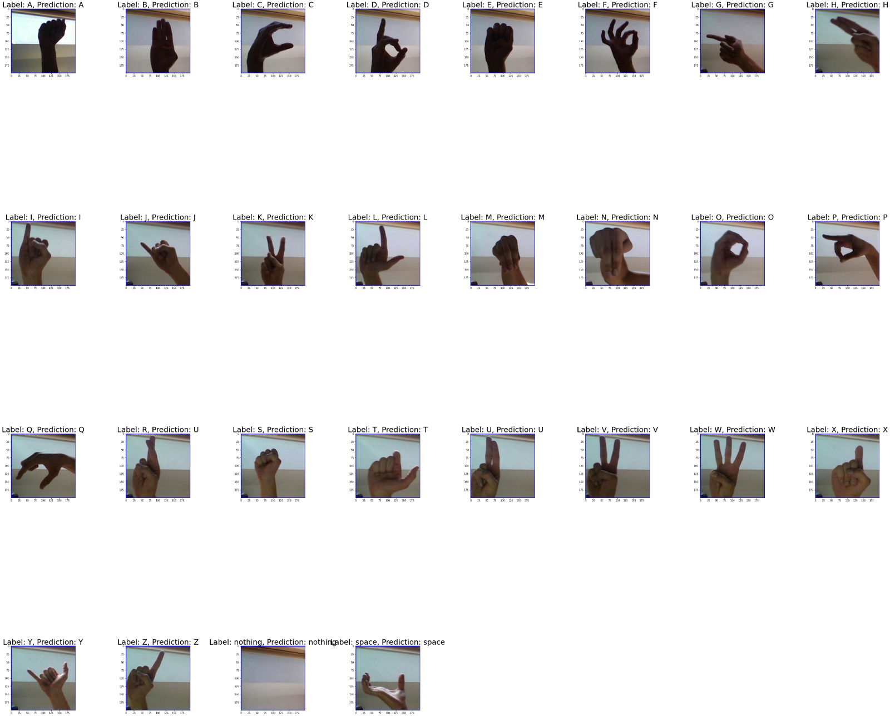

# Deep Learning (CSE 490G1) Final Project: American Sign Language Classification Using Neural Networks
**Group Members: Vivek Patel, Hayoung Jung**

## Abstract
To identify and classify American Sign Language (i.e. ASL) images into correct English alphabet characters, we employed convolutional neural networks in order to effectively execute the task quickly and accurately. The model was trained and tested on 87,000 ASL image dataset from Kaggle. We investigated and experimented with various model network architectures, image data augmentations, hyperparamters, and transfer learning with AlexNet in order to obtain the performance. Our best-performing model achieved an accuracy of 100% on our 29-image test suite of ASL characters while obtaining 98.7126% validation accuracy on the validation set. Our results suggest that 1) deep learning models can accurately classify ASL images, making them incredible tools for those who are beginning to learn American Sign Language, and 2) training simple models from scratch on a dataset can have a much better performance compared to trying to finetune a powerful, complicated network to a different task.  

## Problem Statement
American Sign Language (also known as ASL) is a visual language often used for communication by those who are deaf or hard of hearing. Live ASL interpreters are a facet of many public and private events as a means of increasing accessibility, but for individuals who are new to learning ASL, the interpreters can move too fast. Realtime ASL translation into a familiar language can be a good stepping stone for people in those circumstances, and a piece of that is characterizing individual ASL characters. We believe that neural networks can be incredibly useful tools for classifying each ASL character into english alphabet character accurately and quickly. In this project, we build a convolutional neural network (CNN) to classify a given image of an ASL sign into the correct English alphabet characters.

## Related Work
We used the ASL Alphabet dataset from Kaggle, which contains an 87,000 image training set and 29 image test suite of all the ASL character classes in the dataset. Each image was 200-by-200 pixels with 3 channels for RGB colors. The dataset was split into 29 classes, of which are 26 English alphabet characters and 3 other classes for NOTHING, SPACE, and DELETE. The dataset was designed for realtime applications and classifications -- the dataset can be found at this link: https://www.kaggle.com/datasets/grassknoted/asl-alphabet. 

We also took inspiration for this idea based on an American Sign Language module within LING 200 course offered at the University of Washington (https://myplan.uw.edu/course/#/courses/LING200). Having learned about the significance of ASL for those with speech and hearing difficulties, we wanted to apply both our learning within this Deep Learning course and LING 200 by creating a classifer for ASL images for accurate English character translation.

Within our project, we also performed transfer learning with AlexNet, a previous state-of-the-art Convolutional Neural Network model designed for ImageNet Classification task, for finetuning on the ASL classification task. As a course reading, the AlexNet proved to be a powerful network for the ImageNet competition. We used the same model for this project for a transfer learning comparison -- we obtained the AlexNet through the PyTorch distribution. The article can be found here: https://papers.nips.cc/paper/2012/file/c399862d3b9d6b76c8436e924a68c45b-Paper.pdf.

We personally used PyTorch in order to facilitate the entire deep learning process, MatPlotLib for visualization and graphs, and Numpy for simple arithmetic with the arrays computation. Google Colab's GPU was used for training the models.

## Methodology
After organizing our dataset within Google Colab, we performed data augmentation on the images, specifically the RandomHorizontalFlip and the ColorJitter functions afforded by PyTorch. Having tried multiple data augumentation combination, we found that the particular combination for data augmentation improved the accuracy of our model's prediction enormously. After such data augmentations, we performed an 85%-15% train and validation split on the 87,000 image training set to obtain 73,950 images for the train set and 13,050 images for the validation set. We then uploaded the data into the PyTorch's dataloader.

With the dataloader complete, we experimented with multiple network architectures and hyperparameters to extract features from the ASL images and classify them to the accurate English alphabet characters. We detail the network architectures, hyperparameter values, evaluations, and performance results that worked the best for our given tasks, including the transfer learning for AlexNet, in the next section, specifically the "Experiments/evaluation" section. For each of the network architectures, we show the training loss, validation loss, and validation accuracies graph over each epoch on the best hyperparameter value. At the end, we also show the test accuracy on our 29-test suite image set as well as each individual model predictions on the 29 test images. 

## Experiments/Evaluation
Since we are performing a multiclass classification, we calculated cross entropy loss with mean reduction across all the model architectures including the transfer learning for AlexNet in order to the train the models. Note that we used stochastic gradient descent (SGD) to train the model using the cross entropy loss for all the experiments. We evaluated the experiment and the model results by using the validation accuracy and test accuracy primarily -- we calculated the accuracy based on how often the model was able to correctly predict the image label accordingly based on the ASL image. We also used cross entropy loss on the validation set (averaged across batches) to evaluate the model and decide which hyperparameters to use, but accuracy was our main evaluation metric.

### Experiment 1: ASLv1 Model
Network Architecture: 
```
class ASLNet_Version1(nn.Module):
    def __init__(self):
        super(ASLNet_Version1, self).__init__()
        self.conv1 = nn.Conv2d(3, 16, 2)
        self.maxpool1 = nn.MaxPool2d((3, 3))
        self.conv2 = nn.Conv2d(16, 256, 2)
        self.conv3 = nn.Conv2d(256, 256, 2)
        self.maxpool2 = nn.MaxPool2d((4, 4))
        self.fc1 = nn.Linear(256*256, 420)
        self.fc2 = nn.Linear(420, 29)


        self.accuracy = None

    def forward(self, x):
        x = self.conv1(x)
        x = F.relu(x)
        x = self.maxpool1(x)

        x = self.conv2(x)
        x = F.relu(x)
        x = self.conv3(x)
        x = F.relu(x)
        x = self.maxpool2(x)

        x = torch.flatten(x, 1)
        x = self.fc1(x)
        x = F.relu(x)
        x = self.fc2(x)

        return x
```

Best Performing Hyperparameter values for ASLv1:
```
BATCH_SIZE = 64
TEST_BATCH_SIZE = 10
EPOCHS = 25
LEARNING_RATE = 0.01
MOMENTUM = 0.9
WEIGHT_DECAY = 0.0005
```
### Experiment 2: ASLv2 Model
Network Architecture: 
```
class ASLNet_Version2(nn.Module):
    def __init__(self):
        super(ASLNet_Version2, self).__init__()
        self.conv1 = nn.Conv2d(3, 16, 3)
        self.conv2 = nn.Conv2d(16, 64, 3)
        self.conv3 = nn.Conv2d(64, 128, 3)
        self.conv4 = nn.Conv2d(128, 256, 3)
        self.fc1 = nn.Linear(135424, 512)
        self.fc2 = nn.Linear(512, 29)

        self.maxpool1 = nn.MaxPool2d((2, 2))
        self.maxpool2 = nn.MaxPool2d((4, 4))
        self.accuracy = None

    def forward(self, x):
        x = self.conv1(x)
        x = F.relu(x)
        x = self.conv2(x)
        x = F.relu(x)
        x = self.maxpool1(x)

        x = self.conv3(x)
        x = F.relu(x)
        x = self.conv4(x)
        x = F.relu(x)
        x = self.maxpool2(x)

        x = torch.flatten(x, 1)
        x = self.fc1(x)
        x = F.relu(x)
        x = self.fc2(x)
        return x
```

Best Performing Hyperparameter values for ASLv2:
```
BATCH_SIZE = 64
TEST_BATCH_SIZE = 10
EPOCHS = 10
LEARNING_RATE = 0.01
MOMENTUM = 0.9
WEIGHT_DECAY = 0.0005
```

### Experiment 3: AlexNet Model (Transfer Learning/Finetuning to ASL Classification Task)
Network architecture:
```
----------------------------------------------------------------
        Layer (type)               Output Shape         Param #
================================================================
            Conv2d-1           [-1, 64, 56, 56]          23,296
              ReLU-2           [-1, 64, 56, 56]               0
         MaxPool2d-3           [-1, 64, 27, 27]               0
            Conv2d-4          [-1, 192, 27, 27]         307,392
              ReLU-5          [-1, 192, 27, 27]               0
         MaxPool2d-6          [-1, 192, 13, 13]               0
            Conv2d-7          [-1, 384, 13, 13]         663,936
              ReLU-8          [-1, 384, 13, 13]               0
            Conv2d-9          [-1, 256, 13, 13]         884,992
             ReLU-10          [-1, 256, 13, 13]               0
           Conv2d-11          [-1, 256, 13, 13]         590,080
             ReLU-12          [-1, 256, 13, 13]               0
        MaxPool2d-13            [-1, 256, 6, 6]               0
AdaptiveAvgPool2d-14            [-1, 256, 6, 6]               0
          Dropout-15                 [-1, 9216]               0
           Linear-16                 [-1, 4096]      37,752,832
             ReLU-17                 [-1, 4096]               0
          Dropout-18                 [-1, 4096]               0
           Linear-19                 [-1, 4096]      16,781,312
           Linear-20                  [-1, 512]       2,097,664
             ReLU-21                  [-1, 512]               0
           Linear-22                   [-1, 29]          14,877
================================================================
```

We froze the weights for all layers before layer 19, and trained according to these hyperparameters:
```
BATCH_SIZE = 32
TEST_BATCH_SIZE = 10
EPOCHS = 10
LEARNING_RATE = 0.005
MOMENTUM = 0.6
WEIGHT_DECAY = 0.0005
```
## Results (view in light mode, some images have transparency)

### Result 1: ASLv1 Model
ASLv1 Performance:
* Epoch: 8
* Train Loss: 0.0533818
* Validation Loss: 0.028572216
* Validation Accuracy: 99.21%
* Test Accuracy: 96.428% (i.e. 27/28 examples correct)


### Result 2: ASLv2 Model
ASLv2 Performance:
* Epoch: 10
* Training Loss: 0.024703674171026816
* Validation Loss: 0.04181242462900606
* Validation Accuracy: 98.7126
* Test: 100.0% (i.e. 28/28 examples correct)


### Result 3: AlexNet Model (Transfer Learning/Finetuning to ASL Classification Task)
Modified AlexNet Performance:


* Epoch: 9
* Training Loss: 1.707148460999344
* Validation Loss: 0.04122457779687026
* Validation Accuracy: 54.24521072796935
* Test Accuracy: 71.4285174% (i.e. 20/28 examples correct)


## Examples (view in light mode, some images have transparency)

### Examples 1: ASLv1 Model


### Examples 2: ASLv2 Model


### Examples 3: AlexNet Model (Transfer Learning/Finetuning to ASL Classification Task)

## Video
[Here](https://youtu.be/geiv9Ux8MT0) is a brief video presentation overviewing our project:

[](https://youtu.be/geiv9Ux8MT0)

And [here](https://youtu.be/pgPHhu32z9Q) is a live demo of the networks making predictions:
[](https://youtu.be/pgPHhu32z9Q)
